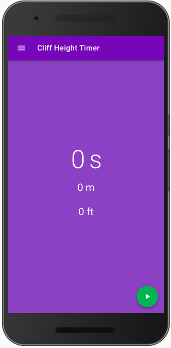

# [WIP] Cliff-Height-Timer-VueJS

« VueJS » version of the Cliff-Height-Timer

;

# Presentation

This is a very simple app that uses basic physics to tell you the height of a cliff or the depth of a well.

## Build

```
npm install
```

## Run

```
npm run dev
```